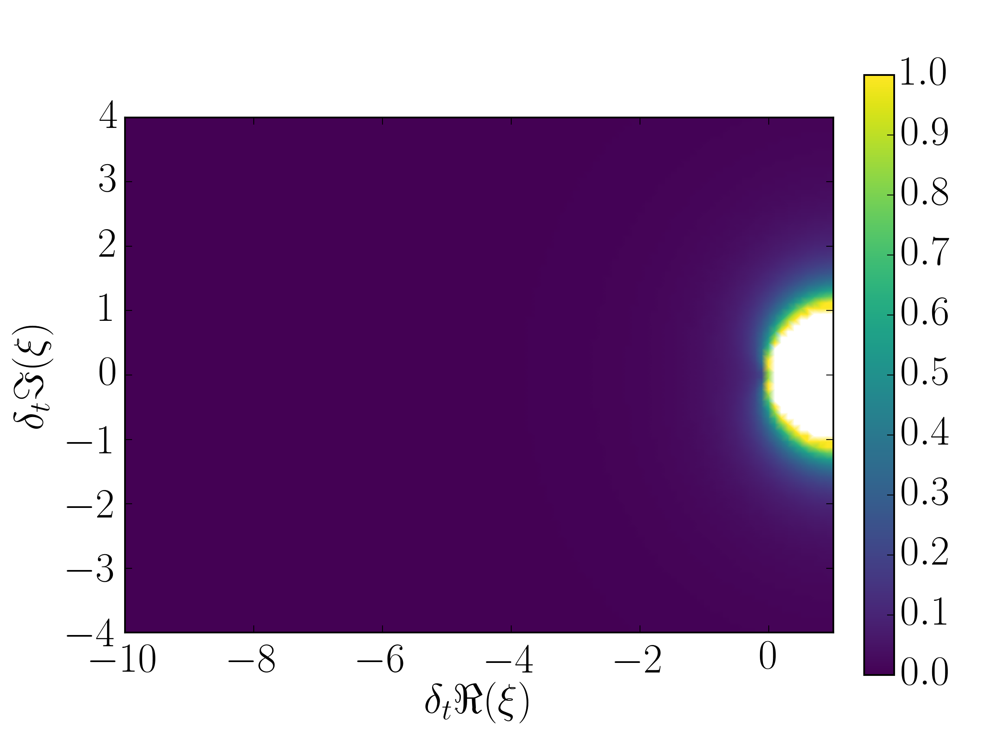

# XBraid-convergence-est

## Operating systems

This code was developed for use with Linux operating systems.

## Installation requirements

The code depends on a number of third-party libraries:

* C++ compiler
* MPI (recommended: MPICH2)
* bootstrap
* armadillo
* optional: Doxygen
* optional: matplotlib (recommended: version >= 1.5.2)

To install bootstrap and armadillo, we recommend using SPACK, since SPACK will install all dependencies (blas, lapack, etc.).

## Makefile targets

    default : builds the default binary
    doxygen : generates the Doxygen source code documentation
    load-packages : loads the recommended libraries using SPACK
    unload-packages : unloads the recommended libraries using SPACK

## Examples

### Commandline options

A list of commandline options is displayed when running:

```
    ./bin/xbraid-convergence-est --help
```

### Compute approximate convergence factor of MGRIT V-cycle with FCF-relaxation

#### Sample complex plane

This example samples spatial eigenvalues in the comlex plane
and computes an approximate convergence factor (according to [Hessenthaler et al.](https://arxiv.org/abs/1812.11508), Approximation 2)
of 5-level MGRIT V-cycles with FCF-relaxation on each level:

```
    ./bin/xbraid-convergence-est                            \
        --number-of-timesteps  1025                         \
        --number-of-time-grids 5                            \
        --coarsening-factors   2 2 2 2                      \
        --runge-kutta-method L_stable_SDIRK1                \
        --sample-complex-plane -10.0 1.0 -4.0 4.0           \
        --complex-plane-sample-size 110 90                  \
        --bound error_l2_sqrt_expression_approximate_rate   \
        --bound-on-level 1                                  \
        --V-cycle                                           \
        --relaxation-scheme FCF_relaxation                  \
        --output-file V-cycle_FCF-relaxation_approx
```

This will produce the following output:

* dteta_l0.txt : contains the sampled spatial eigenvalues
* V-cycle_FCF-relaxation_approx.txt : contains the approximate convergence factor for all samples
* max_V-cycle_FCF-relaxation_approx.txt : contains the maximum approximate convergence factor

Results can be visualized by running:

```
    python3 utils/heatmap.py dteta_l0.txt V-cycle_FCF-relaxation_approx.txt NAN NAN NAN NAN 0.0 1.0
```

This will visualize the approximate convergence factors in the complex plane:



To find out more about the arguments of the Python script, run:

```
    python3 utils/heatmap.py
```

## Source code documentation

Doxygen is used to automatically generate source code documentation.
See doc/doxygen/html/index.html
